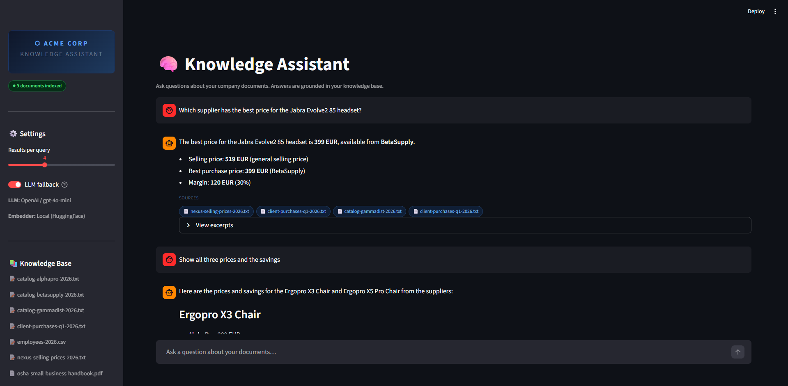

# RAG Knowledge Assistant

[](https://www.python.org)
[](https://python.langchain.com)
[](https://faiss.ai)
[](https://streamlit.io)
[](LICENSE)

A production-ready RAG (Retrieval-Augmented Generation) system that turns a company's
documents into an always-available, citation-backed knowledge base — deployable in
under 10 minutes with zero infrastructure.

---

## Demo

[](https://www.loom.com/share/fbe9e758e2d84c6993c3c22855a16d6c)

---

## How This Saves 10 Hours Per Week

Every SME has the same problem: knowledge trapped in PDFs, policy documents, and
procedure guides that employees have to manually hunt through.

| Before | After |
|--------|-------|
| "Where is the refund policy?" → 15 min searching shared drives | → 5-second AI answer with exact citation |
| New employee onboarding reading → 3 hours of manuals | → Conversational Q&A guided tour |
| "What did the Q3 report say about margins?" → Find + open + Ctrl+F | → Direct answer with page reference |
| Compliance question → Email legal team, wait 24h | → Instant answer from policy documents |

**Conservative estimate: 2–3 queries/employee/day × 15 min saved × 10 employees = 10h/week.**

---

## Features

- **Multi-format document loading** — PDF, TXT, MD, CSV, DOCX, and JSON files supported
- **Smart chunking** — `RecursiveCharacterTextSplitter` with configurable size and overlap
- **Dual embedder** — OpenAI `text-embedding-3-small` (accuracy) or HuggingFace `sentence-transformers/all-MiniLM-L6-v2` (free, offline)
- **Incremental FAISS index** — new files are added to the existing index without a full rebuild; modifications or deletions trigger a full rebuild automatically
- **Hybrid search** — optional BM25 + semantic retrieval via `EnsembleRetriever` (better for product codes and proper nouns)
- **Confidence scoring** — every retrieved passage is scored and color-coded (high / medium / low); passages below the configured threshold are filtered out
- **Cited answers** — every response shows source filename, PDF page number, and a text excerpt
- **Streaming responses** — token-by-token output via SSE, no waiting for long answers
- **LLM fallback** — when no relevant document is found, the AI answers from general knowledge with a clear warning banner
- **Multi-turn conversation** — last 3 exchanges are included as context for follow-up questions
- **In-app document management** — upload or delete files directly from the UI; the index reloads automatically
- **Conversation export** — download the full chat history as a Markdown file

---

## Two Deployment Modes

The project ships with two independent interfaces that share the same `core/` pipeline:

| Mode | When to use | How to start |
|------|-------------|--------------|
| **Streamlit** (standalone) | Quick demo, local use, single user | `streamlit run app/main.py` |
| **FastAPI + Next.js** (full-stack) | Multi-user deployment, custom UI, API integration | `uvicorn backend.main:app` + `cd frontend && npm run dev` |

---

## Quick Start — Streamlit Mode

### 1. Clone and install

```bash
git clone https://github.com/VDurocher/RAG-Knowledge-Assistant.git
cd RAG-Knowledge-Assistant

python -m venv .venv
source .venv/bin/activate  # Windows: .venv\Scripts\activate

pip install -r requirements.txt
```

### 2. Configure

```bash
cp .env.example .env
```

Edit `.env` and set your OpenAI API key:

```env
OPENAI_API_KEY=sk-...
EMBEDDER_TYPE=local       # "local" = free HuggingFace embeddings
OPENAI_CHAT_MODEL=gpt-4o-mini
```

### 3. Add your documents

```bash
cp your_documents/*.pdf knowledge_base/
cp your_policies/*.txt knowledge_base/
```

Supported formats: PDF, TXT, MD, CSV, DOCX, JSON.

### 4. Launch

```bash
streamlit run app/main.py
```

Open `http://localhost:8501` — the index builds automatically on first launch.

---

## Quick Start — FastAPI + Next.js Mode

### 1. Install Python dependencies

```bash
pip install -r requirements.txt
pip install -r backend/requirements.txt
```

### 2. Start the API

```bash
uvicorn backend.main:app --reload
```

The API is available at `http://localhost:8000`. Interactive docs at `http://localhost:8000/docs`.

### 3. Start the frontend

```bash
cd frontend
npm install
npm run dev
```

Open `http://localhost:3000`.

---

## Architecture

```
User Question
     │
     ▼
┌────────────────────────┐     ┌─────────────────────────┐
│  Streamlit UI           │  OR │  Next.js 16 Frontend     │
│  app/main.py            │     │  frontend/               │
└────────┬───────────────┘     └────────────┬────────────┘
         │                                  │ HTTP SSE
         │                                  ▼
         │                     ┌─────────────────────────┐
         │                     │  FastAPI Backend         │
         │                     │  backend/main.py         │
         │                     │  POST /api/chat          │
         │                     │  GET  /api/documents     │
         │                     │  POST /api/documents/upload │
         │                     │  DELETE /api/documents/{f}  │
         │                     │  POST /api/rebuild       │
         │                     │  GET  /api/status        │
         │                     └────────────┬────────────┘
         │                                  │
         └─────────────────┬────────────────┘
                           ▼
              ┌─────────────────────┐
              │  core/ pipeline      │
              │  config · loader     │
              │  indexer · rag       │
              └──────┬──────────────┘
                     │
          ┌──────────┴──────────┐
          ▼                     ▼
┌─────────────┐      ┌──────────────────┐
│ FAISS Index │      │  LLM             │
│ (on disk)   │      │  OpenAI / Ollama │
└──────┬──────┘      └──────────────────┘
       │
       ▼
┌──────────────────────────────────────────┐
│  knowledge_base/                          │
│  ├── contract.pdf    (PyPDFLoader)        │
│  ├── policy.txt      (TextLoader)         │
│  ├── guide.md        (TextLoader)         │
│  ├── data.csv        (CSVLoader)          │
│  ├── report.docx     (Docx2txtLoader)     │
│  └── config.json     (TextLoader)         │
└──────────────────────────────────────────┘
```

Full architecture documentation: [`docs/architecture.md`](docs/architecture.md)

---

## Zero-Cost Mode (Fully Local)

Run the entire system with no API key and no cloud dependency using [Ollama](https://ollama.com).

```bash
# 1. Install Ollama (https://ollama.com)
# 2. Pull a local model
ollama pull llama3.2

# 3. Configure .env
LLM_TYPE=ollama
EMBEDDER_TYPE=local
# OPENAI_API_KEY is not needed
```

| Mode | Embeddings | Generation | Cost | Privacy |
|------|-----------|------------|------|---------|
| **Full local** | HuggingFace | Ollama (llama3.2) | Free | 100% on-premise |
| **Hybrid** | HuggingFace | OpenAI GPT-4o-mini | ~$6/month | Queries sent to OpenAI |
| **Full cloud** | OpenAI | OpenAI GPT-4o | ~$60/month | Best accuracy |

> **Note:** Local LLMs (Ollama) are slower and less accurate than GPT-4o on complex reasoning.
> For production deployments with sensitive documents, the full-local mode is the recommended starting point.

---

## Configuration Reference

| Variable | Default | Description |
|----------|---------|-------------|
| `LLM_TYPE` | `openai` | `openai` (cloud) or `ollama` (local, free) |
| `OPENAI_API_KEY` | — | Required only when `LLM_TYPE=openai` or `EMBEDDER_TYPE=openai` |
| `OPENAI_CHAT_MODEL` | `gpt-4o-mini` | Any OpenAI chat model |
| `OLLAMA_MODEL` | `llama3.2` | Any model pulled via `ollama pull` |
| `OLLAMA_BASE_URL` | `http://localhost:11434` | Ollama server URL |
| `EMBEDDER_TYPE` | `local` | `local` (HuggingFace, free) or `openai` (text-embedding-3-small) |
| `LOCAL_EMBED_MODEL` | `sentence-transformers/all-MiniLM-L6-v2` | Any sentence-transformers model |
| `RETRIEVAL_K` | `4` | Passages retrieved per query. Increase for complex questions |
| `RETRIEVAL_SCORE_THRESHOLD` | `0.3` | Minimum confidence score (0.0 = disabled). Passages below this are filtered out |
| `HYBRID_SEARCH` | `false` | Enable BM25 + semantic hybrid retrieval. Requires `rank-bm25` |
| `BM25_WEIGHT` | `0.4` | BM25 weight in hybrid mode (0.4 = 40% keyword, 60% semantic) |
| `CHUNK_SIZE` | `1000` | Characters per chunk. Lower for precise retrieval, higher for context |
| `CHUNK_OVERLAP` | `200` | Overlap between chunks to avoid cutting mid-sentence |

---

## Project Structure

```
RAG-Knowledge-Assistant/
├── app/
│   └── main.py              # Streamlit UI (chat, sidebar, citations, upload)
├── backend/
│   ├── main.py              # FastAPI app (lifespan, CORS)
│   ├── deps.py              # Pipeline singleton (shared state across requests)
│   ├── requirements.txt     # FastAPI-specific dependencies
│   └── routes/
│       ├── chat.py          # POST /api/chat — SSE streaming
│       └── documents.py     # CRUD /api/documents + /api/rebuild + /api/status
├── core/
│   ├── config.py            # Settings dataclass with .env loading
│   ├── loader.py            # PDF/TXT/CSV/DOCX/JSON/MD ingestion
│   ├── indexer.py           # FAISS index construction, caching, incremental updates
│   └── rag.py               # Retrieval chain, LLM, streaming, confidence scoring, citations
├── frontend/                # Next.js 16 frontend (optional — for FastAPI mode)
├── knowledge_base/          # Drop your documents here
├── vector_store/            # Auto-generated FAISS index (gitignored)
├── docs/
│   └── architecture.md      # Detailed design documentation
└── tests/
    ├── test_loader.py        # Document loading unit tests
    └── test_indexer.py       # Index and chunking unit tests
```

---

## Running Tests

```bash
pytest tests/ -v --cov=core --cov-report=term-missing
```

Expected output:
```
tests/test_loader.py::TestLoadDocuments::test_loads_txt_files PASSED
tests/test_loader.py::TestLoadDocuments::test_ignores_unsupported_extensions PASSED
tests/test_loader.py::TestLoadDocuments::test_source_metadata_is_filename_only PASSED
tests/test_loader.py::TestLoadDocuments::test_raises_when_folder_missing PASSED
tests/test_indexer.py::TestSplitDocuments::test_splits_long_document PASSED
tests/test_indexer.py::TestSplitDocuments::test_preserves_metadata PASSED
...
```

---

## Cost Estimate

| Setup | Monthly cost (100 employees, 20 queries/day) |
|-------|----------------------------------------------|
| Local embeddings + GPT-4o-mini | ~$6/month |
| OpenAI embeddings + GPT-4o-mini | ~$8/month |
| OpenAI embeddings + GPT-4o | ~$60/month |

Re-embedding only occurs when new documents are added or existing ones are modified.

---

## Extending the System

**Add a new file type:**

```python
# core/loader.py
from langchain_community.document_loaders import Docx2txtLoader

_SUPPORTED_EXTENSIONS: dict[str, type] = {
    ".pdf": PyPDFLoader,
    ".txt": TextLoader,
    ".md": TextLoader,
    ".docx": Docx2txtLoader,  # Add this
}
```

**Switch to a persistent vector database (Chroma):**

```python
# core/indexer.py — replace FAISS with Chroma for > 10k pages
from langchain_community.vectorstores import Chroma

vector_store = Chroma.from_documents(
    chunks, embeddings, persist_directory=str(settings.vector_store_path)
)
```

**Add authentication:**
Wrap the Streamlit app with `streamlit-authenticator` for user-level access control.

---

## Requirements

- Python 3.11+
- OpenAI API key (for answer generation — not required in full-local mode)
- ~500 MB disk space for local embedding model (downloaded on first run)
- 4 GB RAM recommended for local embeddings
- Node.js 20+ (only for the Next.js frontend)

---

## License

MIT — see [LICENSE](LICENSE)
